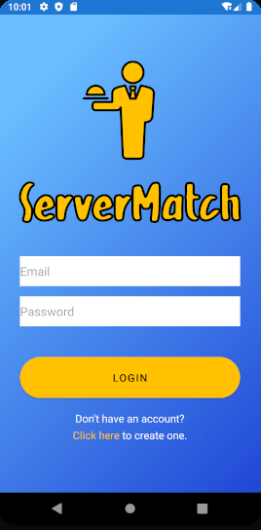
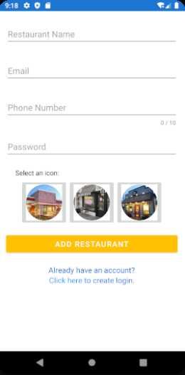
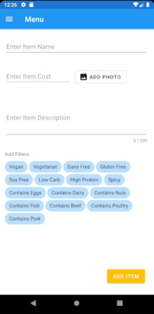

# ServerMatch

## What is ServerMatch?
Server Match is an app that caters specifically to servers, by offering easy to manage menu options and a system of filters to assist in offering recommendations to hungry customers. With over 2.6 million servers within the United States alone, a less daunting Point of Sale (POS) system that focuses on efficiency and accessibility is necessary for retailers and servers with less tech experience.

Server Match makes maintaining a list of menu items easier than ever with features like simple menu addition options, quick cart and menu updates, and a variety of bubble tags to filter through the menu. Its portability as a mobile-app also makes it an ideal option for small businesses with limited physical space or funds.

&nbsp;

## Software Architecture
### MVVM Architecture
We chose a Model-view-viewmodel(MVVM) software architecture since google has a built in observer methods for any data changes. With these reactions to changes happening in real time  it makes my restaurant POS system accurate. 

Here are some component definitions of this pattern found:
The View — that informs the ViewModel about the user’s actions
The ViewModel — exposes streams of data relevant to the View
The DataModel — abstracts the data source. The ViewModel works with the DataModel to get and save the data.

&nbsp;

## Usage & Features
### Login & Setup Restaurant Captures
| |  |
|--------------| ------------------------|
| Login | Setup Restaurant |

&nbsp;

### Menu & Menu Items
| |  |  |  | 
|--------------| ------------------------|  ------------------- |  ------------------- |
| Menu | Menu Item (Long Click) | Add Menu Item | Filter Menu |

&nbsp;

### Customers
| |  |  |
|--------------| ------------------------|  ------------------- |
| Frequent Customers | Customer (On Click) | Add Customer |

&nbsp;

### Navigation
|  |
|--------------|
| Navigation Bar |

&nbsp;

